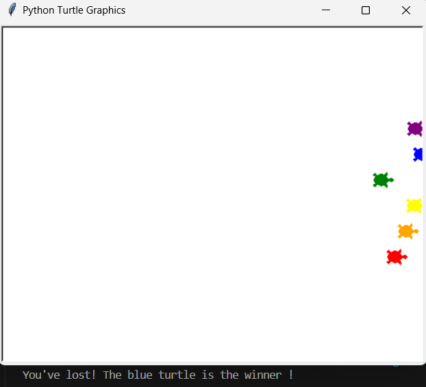

# 🐢 Turtle Coordinate Race Simulator
*A visually engaging Python based race simulation leveraging the Turtle Graphics library, where six vibrant racers compete on a 2D coordinate plane and the outcome is driven by randomized, real time movements.*

---

## Overview
The **Turtle Coordinate Race Simulator** is an interactive desktop application built in Python that demonstrates fundamental game logic, coordinate system manipulation, and object oriented graphics programming.

In this simulation, players place a wager on a turtle racer of their choice, each uniquely colored and positioned on a dedicated racing track. The program uses **randomized motion logic** to determine each turtle's progression toward the finish line, ensuring an unpredictable and replayable outcome.

This project exemplifies **event-driven design** combined with **coordinate-based movement algorithms**, providing a playful yet technically instructive example of how graphical simulations are structured in Python.

---

## Technologies & Concepts Used
- **Python 3.13** – Core programming language for implementing the simulation logic.
- **Turtle Graphics Module** – Provides object oriented control of graphical entities within a 2D coordinate system.
- **Random Module** – Generates pseudo random integer values to vary movement distances per frame.
- **2D Coordinate System Manipulation**  
  - Absolute positioning with `.goto(x, y)` for initial placement.  
  - Relative positioning via `.forward()` and `.xcor()` checks.
- **User Interaction & Input Handling** – Real time player betting through text prompts.
- **Event Driven State Management** – Controlled race start/stop conditions using a Boolean flag (`is_race_on`).
- **List-Based Object Collection** – Stores and iterates over multiple turtle instances for efficient game loop execution.
- **Loop Structures for Animation** – Continuous position updates using `while` and `for` loops to simulate motion frames.
- **Environment Variable Configuration** – Custom `TCL` and `TK` path binding for GUI compatibility on specific OS setups.

---

## Gameplay Mechanics
1. **Initialization**  
   - Six turtle racers are instantiated, each assigned a **distinctive shell color** from a predefined palette: `red`, `orange`, `yellow`, `green`, `blue`, `purple`.
   - Racers are aligned at the **starting line** (x = -230) with staggered `y` coordinates to visually represent parallel lanes.
   - The screen canvas is configured to a **500x400 pixel** viewing area for optimal track layout.

2. **Player Bet Phase**  
   - Upon program start, the player is prompted to enter a turtle color as their **predicted winner**.
   - The simulation remains idle until the player confirms their choice, ensuring the race does not start prematurely.

3. **Race Execution**  
   - Once initiated, the race proceeds in **continuous iterations**, where each turtle advances by a random integer between **0 and 10 pixels** per frame.
   - The `while is_race_on` loop governs the race lifecycle, checking for win conditions after each movement cycle.

4. **Victory Determination**  
   - A turtle is declared the winner when its **x-coordinate exceeds 230 pixels**, representing the finish line.
   - The winning turtle’s color is retrieved via `.pencolor()` and compared with the player's bet.
   - The result is displayed in the console with a **win/loss message**.

5. **Replay Potential**  
   - Each race outcome is inherently unpredictable due to **randomized distances**, offering replayability without altering the core logic.

---

## 🧱 Project Structure

```
turtle-coordinate-race-simulator/
    ├── main.py             # Main program file
    ├── README.md           # Project documentation
    └── sample_output.png   # Screenshot of race simulation
```

---

### 🚀 How to Run

> ⚠️ Ensure you have **Python 3.10+** installed.

### Prerequisites
- Python 3.10 or above
- Compatible terminal or IDE (e.g., VS Code, PyCharm)

1. Install the required dependencies (if not already present):
   ```bash
   pip install turtle
   ```

2. **Clone the repository**
   ```bash
   git clone https://github.com/your-username/turtle-coordinate-race-simulator.git
   ```

3. **Navigate to the project folder**
   ```bash
   cd turtle-coordinate-race-simulator
   ```

> 💡 **Optional – Windows Only:** If you encounter errors related to `TCL_LIBRARY` or `TK_LIBRARY`, ensure that your Python installation's Tcl paths are correctly set using `os.environ` at the beginning of your script:
   ```bash
   import os
   os.environ['TCL_LIBRARY'] = r'C:\Program Files\Python313\tcl\tcl8.6'
   os.environ['TK_LIBRARY'] = r'C:\Program Files\Python313\tcl\tk8.6'
   ```

4. **Run the script**
   ```bash
   python main.py
   ```

---

## 📜 Sample Output

### Console Output Examples

**✅ Winning Scenario**

```
Make your bet: green
You've won! The green turtle is the winner!
```

**❌ Losing Scenario**

```
Make your bet: red
You've lost! The yellow turtle is the winner!
```

---

### Graphical Simulation Snapshot



> Six uniquely colored turtles line up on the virtual track, awaiting the start signal.  
> As the race begins, each moves forward unpredictably, driven by randomized increments — keeping every finish tense and exciting.

---

## 🚀 Key Highlights

- **🎯 Player-Centric Interaction** – Engage directly with the simulation by betting on your chosen turtle before the race begins.  
- **🌈 Distinct Visual Design** – Each turtle has a dedicated lane and unique shell color for easy visual tracking.  
- **⚡ Dynamic Randomized Motion** – Movement distances per frame are randomly generated, ensuring unpredictability.  
- **📐 True Coordinate-Based Positioning** – Utilizes a precise 2D Cartesian coordinate system for race setup and progression tracking.  
- **🔁 Infinite Replay Value** – Every race produces a unique outcome thanks to random motion logic.  
- **🧩 Structured & Readable Logic** – The program is divided into clear setup, execution, and result phases for maintainability.  
- **💻 Lightweight & Dependency-Free** – Runs natively on Python’s standard library — no external installations required.

---

## 🙌 Credits

This project was **conceptualized and coded** by **Siddha Kadam**, applying learned principles of:

- **Object-Oriented Programming** – For creating and managing multiple autonomous turtle racers.
- **Event-Driven Control Flow** – For race initiation and dynamic win detection.
- **Randomized Algorithmic Logic** – For generating unpredictable race outcomes.

The inspiration and foundational knowledge for this simulation were acquired during the course *"100 Days of Code: The Complete Python Pro Bootcamp"* by **Dr. Angela Yu**.  
While the idea originated as part of structured learning, the **entire implementation, logic enhancements, and code structuring were executed independently**, ensuring the project reflects personal problem-solving ability and coding style.

> This project is both a learning milestone and a showcase of translating programming concepts into an engaging, interactive graphical application.
